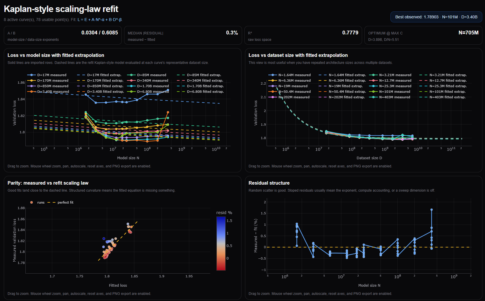

# Scaling Laws Visualizer

[](https://eshwaryforreasons.github.io/scaling_laws_visualizer)


A web-based toolkit for designing, fitting, comparing, and diagnosing Kaplan-style neural scaling-law experiments.

This project is built for exploring how model size, dataset size, training compute, and validation loss interact in language-model-style training runs. It is especially useful when running many training sweeps and exporting the results as a `pandas` DataFrame / CSV. The app provides interactive plots, scaling-law fits, Kaplan-style comparisons, and practical recommendations for whether a run is model-limited, data-limited, compute-limited, undertrained, or not yet showing clean scaling.

Although this project was developed for `particleGPT` / hadronic event modeling experiments, the workflow is intentionally general: any experiment table with model size, token count, training progress, and validation-loss columns can be inspected.

---

## What this project does

The visualizer helps answer questions like:

- Does validation loss improve predictably with model size?
- Does validation loss improve predictably with dataset size?
- Are my models undertrained, overfitting, or data-limited?
- How do my fitted scaling constants compare to Kaplan et al.?
- Given a model configuration, what dataset size or compute budget is reasonable?
- Which training runs are outliers or likely misconfigured?
- How should I choose the next scaling sweep?

The main idea is to turn a CSV of training results into interactive diagnostic plots and fitted scaling-law summaries.

---

## Core features

### 1. CSV-based experiment input

Most pages accept experiment data as a CSV export from a `pandas` DataFrame.

A typical workflow looks like:

```python
df.to_csv("scaling_sweep_results.csv", index=False)
```

Then paste or upload the CSV into the relevant page.

The expected table usually contains columns such as:

```text
model_name
num_train_tokens
num_val_tokens
num_params
n_layer
n_head
n_embd
batch_size
gradient_accumulation_steps
block_size
learning_rate
lr_decay_iters
min_saved_train_loss
min_saved_val_loss
compute_time_trained
compute_time_saved
coverage
mmd
kpd_median
fpd_value
```

The app does not require every column for every page, but the most important columns are:

| Column | Meaning |
|---|---|
| `model_name` | Name or identifier for each training run |
| `num_params` | Total model parameter count |
| `num_train_tokens` | Number of training tokens used for the run |
| `min_saved_train_loss` | Best saved training loss |
| `min_saved_val_loss` | Best saved validation loss |
| `compute_time_trained` / `compute_time_saved` | Runtime or compute proxy, if available |
| `n_layer`, `n_head`, `n_embd` | Architecture metadata |
| `batch_size`, `gradient_accumulation_steps`, `block_size` | Training-token throughput metadata |

---

## Main pages

The project is organized around several analysis pages. Each page focuses on a different part of the scaling-law workflow.

### `/designer`

The designer page is used to plan scaling-law sweeps before training.

It helps configure model families, dataset sizes, sweep dimensions, and training budgets. It is useful for deciding which runs should be launched next.

Typical uses:

- Design 1D or 2D sweeps.
- Explore model-size and dataset-size grids.
- Export sweep configurations.
- Re-import saved sweep configuration JSON.
- Resume previous planning sessions.
- Interactively inspect planned compute, token counts, and architecture choices.

The sweep config JSON acts like a lightweight save file for the page.

Example sweep-config structure:

```json
{
  "route": "/designer",
  "sweep": {
    "mode": "1d",
    "axis": "num_params",
    "values": [20000000, 40000000, 80000000]
  },
  "training": {
    "batch_size": 32,
    "gradient_accumulation_steps": 96,
    "block_size": 1024
  }
}
```

---

### `/compare`

The compare page compares your experimental curves against Kaplan-style expectations.

It is designed for cases where you already have completed training runs and want to understand how they behave relative to known scaling-law trends.

Typical uses:

- Paste a CSV of completed runs.
- Plot validation loss versus model size.
- Plot validation loss versus dataset size.
- Compare curves across dataset sizes or architecture classes.
- Identify runs that do not follow expected trends.
- Diagnose whether curves are flat, noisy, data-limited, or architecture-limited.
- Get practical suggestions for improving future sweeps.

This page is especially useful after an initial experiment when the plots do not show clean scaling and you want to understand why.

---

### `/fix`

The fix page focuses on diagnosing why a sweep is not showing clean Kaplan-style scaling.

It is intended as a troubleshooting page.

Typical uses:

- Find suspicious outliers.
- Compare training loss and validation loss.
- Detect overfitting or undertraining.
- Detect models that were probably stopped too early.
- Detect dataset-size curves that are too close together.
- Suggest concrete changes to the sweep design.
- Recommend whether to increase dataset size, model size, compute, or training duration.

This page is useful when the experimental results are confusing and you want a practical next-step recommendation.

---

### `/refit`

The refit page fits Kaplan-like scaling-law forms directly to your data.

It estimates constants from your own experiment table and reports fitted coefficients, residuals, extrapolated curves, and comparison plots.

Typical uses:

- Fit loss as a function of model size.
- Fit loss as a function of dataset size.
- Fit combined scaling-law forms.
- Estimate asymptotic loss floors.
- Compare your fitted constants to Kaplan-style constants.
- Generate extrapolated plots beyond the measured sweep range.
- Inspect residuals to see whether a scaling-law fit is actually meaningful.

This page is the most direct way to answer:

> “Given my current results, what scaling law do my runs appear to follow?”

---

## Scaling-law analysis

The project is inspired by the empirical scaling-law program introduced by Kaplan et al. and related follow-up work.

In broad terms, the app looks for power-law-like behavior of the form:

```text
Loss ≈ irreducible_loss + A * N^(-alpha)
Loss ≈ irreducible_loss + B * D^(-beta)
```

where:

| Symbol | Meaning |
|---|---|
| `Loss` | Validation loss or another held-out metric |
| `N` | Model size, usually number of parameters |
| `D` | Dataset size, usually number of training tokens |
| `A`, `B` | Scale constants |
| `alpha`, `beta` | Scaling exponents |
| `irreducible_loss` | Approximate loss floor |

The app also supports Kaplan-style comparisons where your fitted constants are displayed next to reference constants from the literature. This makes it easier to see whether your experiment behaves like a standard language-model scaling experiment or whether your setup has different scaling behavior.

---

## Interactive plots

Many plots are interactive, allowing you to:

- Zoom along the x-axis or y-axis.
- Pan around dense regions.
- Inspect points with hover labels.
- Compare traces across dataset sizes.
- Toggle curves on and off.
- Inspect extrapolated fits.

This is especially helpful for scaling-law data because the most important structure often appears on log-log axes and can be hard to inspect with static plots.

---

## Recommended workflow

A typical end-to-end workflow is:

1. **Plan the sweep in `/designer`**

   Choose model sizes, dataset sizes, training budgets, and sweep axes.

2. **Train the models**

   Run the generated configs on your cluster or training environment.

3. **Export results to CSV**

   Collect the training logs into a single `pandas` DataFrame and export it:

   ```python
   df.to_csv("scaling_results.csv", index=False)
   ```

4. **Inspect results in `/compare`**

   Check whether curves are monotonic, whether larger models improve, and whether larger datasets help.

5. **Diagnose problems in `/fix`**

   Look for undertraining, overfitting, insufficient dataset separation, poor hyperparameters, or outlier runs.

6. **Fit scaling laws in `/refit`**

   Estimate constants from your own data and compare them against Kaplan-style reference values.

7. **Design the next sweep**

   Use the diagnosis and fitted curves to decide which model sizes, dataset sizes, or compute budgets to try next.

---

## Example interpretation guide

The visualizer is meant to help with practical decisions. Some common outcomes are:

| Observation | Likely interpretation | Suggested action |
|---|---|---|
| Larger models do not improve validation loss | Model scaling is not visible yet, or all models are undertrained | Train longer, check learning-rate schedule, verify loss logging |
| Larger datasets do not improve validation loss | Dataset sizes may be too close, or models are too small to benefit | Increase dataset separation or use larger models |
| Training loss improves but validation loss does not | Possible overfitting or distribution mismatch | Check validation set, regularization, and train/val split |
| Small models improve but large models do not | Large models may be undertrained or unstable | Adjust learning rate, warmup, batch size, or training duration |
| Curves are noisy and non-monotonic | Sweep may be too sparse or runs may not be comparable | Add repeated runs or improve hyperparameter consistency |
| Fitted exponents are unstable | Not enough dynamic range in model size or dataset size | Add wider sweeps before trusting extrapolations |

---

## Installation

This project is designed as a modern JavaScript / React-style web app. If this is a Next.js app, the usual setup is:

```bash
npm install
npm run dev
```

Then open:

```text
http://localhost:3000
```

If your project uses a different package manager, use the corresponding command:

```bash
pnpm install
pnpm dev
```

or

```bash
yarn
yarn dev
```

---

## Suggested project structure

A typical structure is:

```text
.
├── src/
│   └── app/
│       ├── designer/
│       │   └── page.js
│       ├── compare/
│       │   └── page.js
│       ├── fix/
│       │   └── page.js
│       └── refit/
│           └── page.js
├── public/
├── package.json
├── README.md
└── ...
```

Page roles:

| Path | Purpose |
|---|---|
| `src/app/designer/page.js` | Plan new sweeps and export/import sweep configs |
| `src/app/compare/page.js` | Compare completed runs against Kaplan-style expectations |
| `src/app/fix/page.js` | Diagnose why scaling is weak, noisy, or absent |
| `src/app/refit/page.js` | Fit scaling laws to your own data and estimate constants |

---

## Data preparation

The app works best when each row corresponds to one completed training run or checkpoint summary.

A minimal DataFrame might look like:

```python
import pandas as pd

rows = [
    {
        "model_name": "tp1_d35B",
        "num_params": 20_000_000,
        "num_train_tokens": 35_000_000_000,
        "min_saved_train_loss": 2.31,
        "min_saved_val_loss": 2.45,
        "n_layer": 4,
        "n_head": 2,
        "n_embd": 128,
    },
    {
        "model_name": "tp2_d35B",
        "num_params": 40_000_000,
        "num_train_tokens": 35_000_000_000,
        "min_saved_train_loss": 2.19,
        "min_saved_val_loss": 2.34,
        "n_layer": 8,
        "n_head": 4,
        "n_embd": 256,
    },
]

df = pd.DataFrame(rows)
df.to_csv("scaling_results.csv", index=False)
```

---

## Tips for good scaling-law experiments

For cleaner scaling-law fits:

- Use the same validation set across all runs.
- Use enough separation between dataset sizes.
- Use enough separation between model sizes.
- Keep optimizer and training setup as consistent as possible.
- Train each model long enough for the comparison to be meaningful.
- Avoid comparing models at very different stages of convergence.
- Plot both training loss and validation loss.
- Treat extrapolations cautiously when the measured range is small.
- Do not trust fitted exponents unless residuals and monotonic trends look reasonable.

---

## Limitations

This tool is a visualizer and diagnostic aid, not a replacement for careful experiment design.

In particular:

- Fitted constants can be unstable with too few data points.
- Power-law fits can look convincing even when the sweep is too narrow.
- Noisy or undertrained runs can distort fitted exponents.
- Kaplan-style constants may not transfer directly to non-language domains.
- Validation loss may not fully capture downstream physics quality metrics.
- Extrapolated curves should be treated as hypotheses, not predictions.

---

## Roadmap ideas

Possible future improvements:

- Save and load full analysis sessions.
- Support repeated-run uncertainty estimates.
- Add bootstrap confidence intervals for fitted constants.
- Add explicit compute-optimal frontier estimation.
- Add Chinchilla-style comparisons.
- Add Power-Lines-style batch-size and training-time rules.
- Add automatic run-quality scoring.
- Add exportable figures for papers and presentations.
- Add support for multiple metrics beyond validation loss.
- Add direct import from training log JSONL files.

---

## Citation

If this project is used for Kaplan-style scaling-law analysis, the main reference is:

```text
Kaplan et al.,
"Scaling Laws for Neural Language Models",
arXiv:2001.08361
```

Depending on the analysis being performed, later compute-optimal scaling-law work may also be relevant.

---

## License

Add your preferred license here.

For example:

```text
MIT License
```

---

## Author

Developed for scaling-law analysis of particleGPT and related model-training sweeps.

## Disclaimer

This document was generated with ChatGPT. The code was provided and it was asked to generate this documentation. I have not read through this read me, it is too long and I need to sleep.